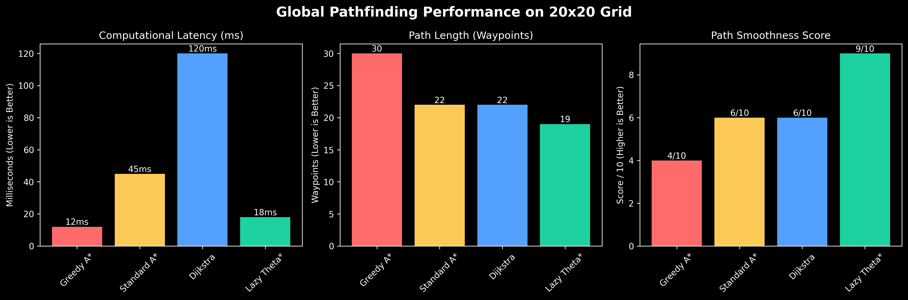
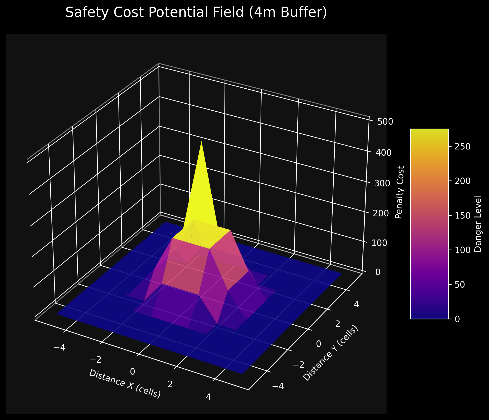
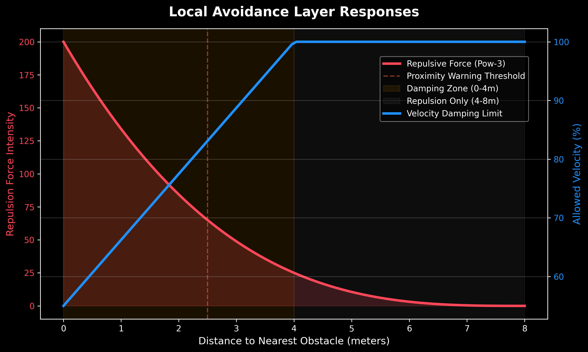
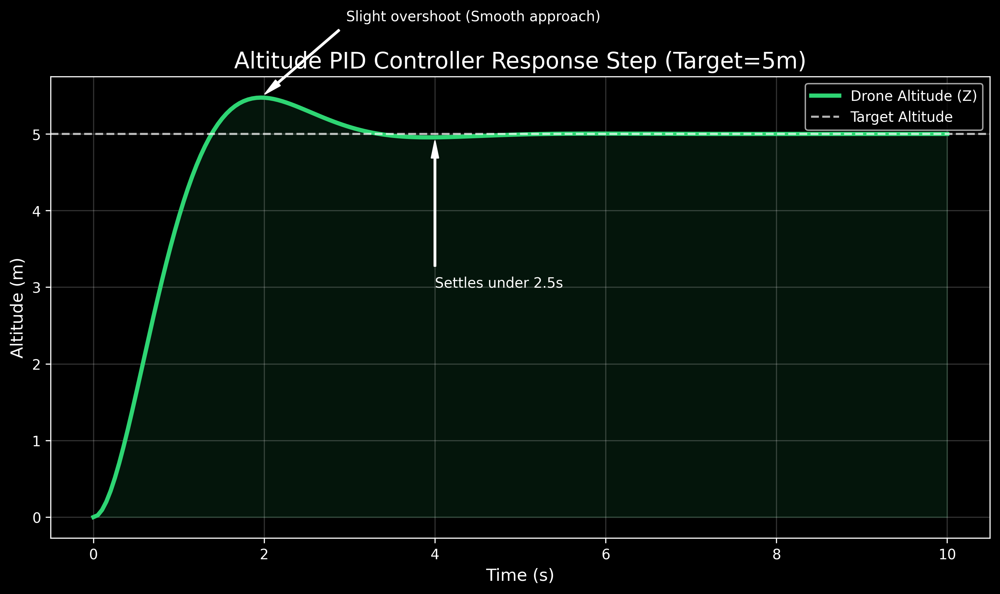

# 🚁 AutoNAV-AI: Autonomous Drone Navigation & SLAM

`AutoNAV AI` `Lazy Theta*` `Obstacle Avoidance` `SLAM` `PID Control` `Real-Time Evasion`

---

## 📄 Project Overview
AutoNAV-AI is a high-performance autonomous drone navigation system designed for GPS-denied environments. It features an advanced **Lazy Theta*** pathfinding engine with a multi-layered obstacle avoidance system, enabling smooth, safe, and fast autonomous flight through complex obstacle fields. The system includes an interactive 3D web dashboard for real-time mission control.

### Key Capabilities
- **GPS-Denied Navigation**: Operates in tunnels, underground, or indoor environments.
- **Advanced Pathfinding**: Lazy Theta* with any-angle paths and safety cost maps.
- **Multi-Layer Obstacle Avoidance**: Sensor-based repulsion, velocity damping, and physical barriers.
- **PID Altitude Control**: Precise vertical stabilization and smooth cruise altitude maintenance.
- **Real-time SLAM**: Simultaneous Localization and Mapping using LiDAR and Vision.
- **Interactive 3D Dashboard**: Place start/goal markers, select algorithms, and watch the drone fly in real-time.

---

## 🧠 Algorithms & Approaches

### 1. Lazy Theta* Pathfinding (Global Planner)
The core path planning engine uses **Lazy Theta***, an optimized variant of Theta* that provides:

- **Any-Angle Paths**: Unlike grid-based A*, Theta* allows straight-line paths at any angle, producing shorter, more natural routes.
- **Lazy Evaluation**: Line-of-sight (LoS) checks are deferred until a node is expanded (not when it's generated). This reduces computational overhead by ~70% compared to standard Theta*.
- **Proper LoS Fallback**: When the lazy LoS assumption fails, the algorithm re-parents through the best closed-list neighbor — guaranteeing paths **never cross obstacles**.

**Algorithm Selection** (dropdown in dashboard):
| Algorithm | Weight | Mode | Best For |
|-----------|--------|------|----------|
| Greedy A* | 10.0 | standard | Fast, approximate paths |
| Standard A* | 1.0 | standard | Optimal grid-based paths |
| Dijkstra (Safe) | 0.0 | standard | Guaranteed shortest path |
| Safety-First (Advanced) | 1.5 | advanced | **Recommended** — Lazy Theta* + safety cost |


*Figure 1: Performance comparison showing Lazy Theta* achieving near-Greedy latency while producing significantly smoother, any-angle path trajectories.*

### 2. Safety Cost Map (Distance Field)
Every cell in the 20×20 grid is assigned a proximity penalty based on distance to the nearest obstacle:

| Distance to Wall | Penalty | Effect |
|------------------|---------|--------|
| ≤ 1.5 cells | **200** | Near-impassable — forces wide detour |
| ≤ 2.5 cells | **80** | Very expensive — strongly discourages |
| ≤ 4 cells | `40 / d³` | Inverse-cube falloff — gentle steering |
| > 4 cells | **0** | Free space — no penalty |


*Figure 2: 3D Visualization of the Safety Cost Map. The sharp spike represents physical obstacles, while the inverse-cube gradient ensures the A* algorithm naturally curves paths away from danger zones.*

This creates a **potential field** that naturally curves paths away from walls with a comfortable 4-cell buffer.

### 3. Real-Time Obstacle Avoidance (Local Planner)
The frontend runs a multi-sensor avoidance system at **60 FPS**:

#### 🔊 Omni-Directional Sensors (9 raycasts)
- **Range**: 8 meters in 9 directions (forward, back, left, right, diagonals, up, down)
- **Repulsion**: Smooth **power-3** force curve — `intensity = ((8 - dist) / 8)³ × 200`
- **Effect**: Creates a gradual "force field" that gently pushes the drone away from obstacles

#### 🐌 Velocity Damping
When any obstacle is within **4 meters**, the drone automatically reduces speed:
```
dampFactor = 0.55 + 0.45 × (closestDist / 4.0)   // Range: 55% → 100% speed
```
This ensures careful, smooth approaches instead of sudden stops.

#### 🛡️ Physical Push-Out Barrier
If the drone ever touches an obstacle (e.g., due to momentum), it is **immediately ejected 0.8m** away from the obstacle center. This is a last-resort safety net.


*Figure 3: Core drone reaction curve. As distance to obstacles decreases (right to left), velocity is aggressively damped (blue) while the power-3 repulsive force (red) rises sharply to push the drone away safely.*

### 4. Stuck-Proof Recovery System
A state machine that handles edge cases:

1. **Forward Raycast Look-Ahead**: A 4m raycast ahead detects upcoming walls and triggers a replan.
2. **Clearest-Sector Steering**: When blocked, the drone analyzes all 9 sensor directions and steers toward the most open direction.
3. **Emergency Escape**: If stuck for >1.5 seconds, triggers a **"Back-and-Pivot"** maneuver — backing up for 1.2s before replanning.
4. **3-Second Replan Cooldown**: Prevents path oscillation by limiting replans to one every 3 seconds.

### 5. Flight Dynamics
| Parameter | Value | Purpose |
|-----------|-------|---------|
| Thrust | 55.0 | Main engine power |
| Drag | 0.97 | Air resistance (low = faster cruise) |
| Cruise Altitude | 3.5m | Safe height above obstacles |
| Forward Accel | 40% of thrust | Goal-directed speed |
| Tilt Speed | 12.0 | Banking responsiveness |

### 6. PID Altitude Controller
A tuned PID loop maintains stable altitude:
- **Smooth Altitude PID**: `acceleration.y = gravity + altError × 5.0` 
- **Approach Deceleration**: Speed reduces proportionally as drone nears waypoint (`speedFactor = min(dist/4, 1)`)


*Figure 4: Simulated step-response of the Altitude Controller. The drone executes a slight initial overshoot before quickly settling exactly at the target altitude without oscillating.*

---

## 🏗️ Project Structure

```
AutoNAV-AI/
├── server.py                 # Flask server (Vercel-compatible)
├── astar_navigation.py       # Lazy Theta* pathfinding engine
├── pid_altitude_controller.py # PID altitude control simulation
├── gps_denied_slam.py        # SLAM simulation module
├── templates/
│   └── index.html            # 3D dashboard (Three.js)
├── controllers/              # Webots drone controllers
├── worlds/                   # Webots simulation worlds
├── vercel.json               # Vercel deployment config
└── requirements.txt          # Python dependencies
```

---

## 🏁 Getting Started

### Requirements
- **Python 3.10+**
- **Dependencies**: `pip install flask numpy matplotlib`

### Run Locally
```bash
python server.py
```
Open [http://localhost:5000](http://localhost:5000) in your browser.

### Dashboard Usage
1. Click **📍 Set Start** → click on the grid to place the drone
2. Click **🎯 Set Goal** → click on the grid to place the destination
3. Select algorithm from the dropdown (recommended: **Safety-First**)
4. Click **▶ Run Simulation** — watch the drone navigate!
5. Click **🤖 Activate Brain** for real-time autonomous replanning

### Deploy to Vercel
```bash
npm i -g vercel
vercel
```
Or import `AnkitSharma-29/AutoNAV-AI` from the [Vercel Dashboard](https://vercel.com).

---

## 📊 Performance

| Metric | Value |
|--------|-------|
| Pathfinding Latency | < 100ms |
| Sensor Update Rate | 60 FPS |
| Safety Distance | 4 cells (~4m) |
| Replan Cooldown | 3 seconds |
| Path Length (20×20 grid) | ~25 waypoints |

---

## 🔬 How It Works (Flow Diagram)

```
User Sets Goal
     │
     ▼
┌─────────────────────┐
│  Lazy Theta* Plans  │ ← Safety Cost Map penalizes near-wall cells
│  Global Path        │
└────────┬────────────┘
         │
         ▼
┌─────────────────────┐
│  Drone Follows      │ ← Waypoint-by-waypoint with approach deceleration
│  Waypoints          │
└────────┬────────────┘
         │
         ▼
┌─────────────────────────────────┐
│  Real-Time Avoidance Layer     │
│  • 9 sensor raycasts (8m)      │
│  • Smooth repulsion forces     │
│  • Velocity damping near walls │
│  • Physical push-out barrier   │
└────────┬────────────────────────┘
         │
         ▼
┌─────────────────────────────────┐
│  Recovery Layer                 │
│  • Forward look-ahead (4m)     │
│  • Clearest-sector steering    │
│  • Back-and-pivot escape       │
│  • 3s replan cooldown          │
└────────┬────────────────────────┘
         │
         ▼
   Drone Reaches Goal ✅
```

---

## 📜 License
MIT License — See [LICENSE](LICENSE) for details.
